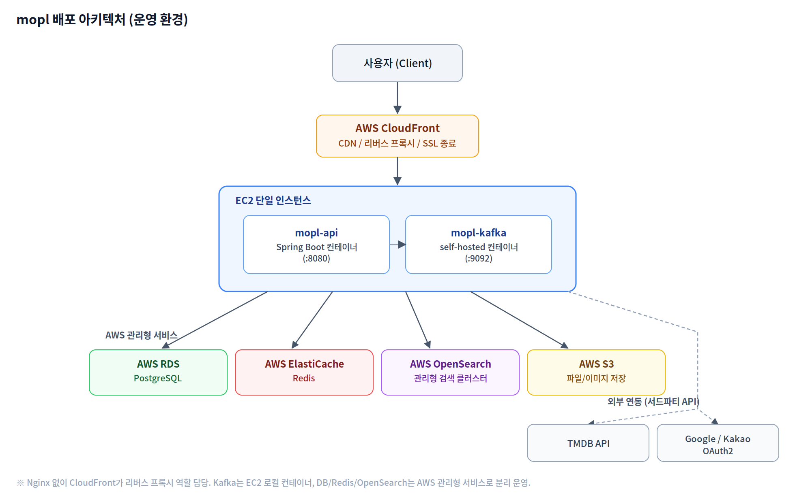
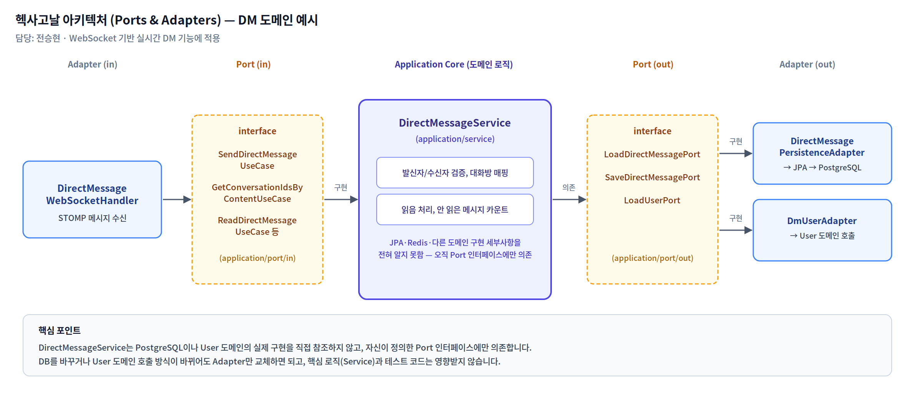

# modu-playlist (mopl)

> "흩어진 콘텐츠를 하나의 플레이리스트로, 함께 보고 함께 이야기하세요!"

모두의 플리 - 콘텐츠(영화/드라마 등)를 모아 플레이리스트로 큐레이션하고, 다른 사용자와 함께 시청하며 소통할 수 있는 콘텐츠 플레이리스트 커뮤니티 서비스의 백엔드 서버입니다.


## Table of Contents

1. [Core Features](#core-features)
2. [Architecture](#architecture)
3. [Trouble Shooting](#trouble-shooting)
4. [File Structure](#file-structure)
5. [Technology Stack](#technology-stack)
6. [Getting Started](#getting-started)
7. [API Documentation](#api-documentation)

---

## Core Features

**인증/인가**: 이메일 회원가입 및 로그인, JWT 기반 인증, Google/Kakao OAuth2 소셜 로그인

**콘텐츠**: TMDB 연동 콘텐츠 수집, OpenSearch 기반 콘텐츠 검색

**플레이리스트**: 플레이리스트 생성/수정/삭제, 콘텐츠 담기

**리뷰**: 콘텐츠에 대한 리뷰 작성/수정/삭제

**팔로우**: 사용자 팔로우/언팔로우

**함께 시청**: 실시간 시청 세션(watching session) 생성 및 참여

**채팅/DM**: 콘텐츠 채팅, 사용자 간 다이렉트 메시지

**알림**: 사용자 행동 기반 실시간 알림

**배치**: ShedLock 기반 분산 락으로 다중 인스턴스 환경에서 안전한 배치 작업 수행

---

## Architecture

### 인프라 아키텍처 (운영 환경)



원래 팀 프로젝트 요구사항은 ECS + nginx + 다중 인스턴스 구성이었습니다. 미션 완료 후 개인적으로 트래픽 규모와 운영 비용을 다시 검토했고, 실사용자가 없는 포트폴리오 성격의 서비스에서 ECS의 오토스케일링·다중 인스턴스 구성은 과설계라고 판단해 EC2 단일 인스턴스로 재구성했습니다. Nginx도 제거하고 AWS CloudFront가 리버스 프록시 겸 SSL 종료 역할을 대신하도록 정리했습니다. DB(RDS)·Redis(ElastiCache)·OpenSearch는 애플리케이션과 분리된 AWS 관리형 서비스로 유지해, EC2 인스턴스 자체는 API 서버와 Kafka 컨테이너만 담당합니다.

### 헥사고날 아키텍처 (Ports & Adapters)



도메인별로 Port(인터페이스)와 Adapter(구현체)를 분리해서, 애플리케이션 핵심 로직이 JPA나 다른 도메인의 구현 세부사항을 직접 알지 못하도록 설계했습니다. 위 다이어그램은 제가 담당한 DM 도메인을 예로 든 것으로, WebSocket으로 들어온 요청이 UseCase 인터페이스 → Service(핵심 로직) → Port 인터페이스를 거쳐 실제 Persistence/User 어댑터에 도달하는 흐름을 보여줍니다. DB를 바꾸거나 다른 도메인 호출 방식이 바뀌어도 Adapter만 교체하면 되고, 핵심 로직과 테스트 코드는 영향받지 않습니다.

---

## Trouble Shooting

### 1. Redis 캐시 스탬피드 — 동시 요청 시 DB 조회가 이론치보다 많이 발생

콘텐츠 캐시가 없는(cold) 상태에서 동일 콘텐츠에 30개의 동시 요청이 몰렸을 때, 이론상으로는 1개 요청만 DB를 조회하고 나머지 29개는 캐시가 채워지길 기다렸다가 캐시를 읽어야 합니다. 하지만 실제로는 DB 조회가 4건 발생했습니다.

Spring Data Redis의 기본 `RedisCacheWriter`(non-locking)는 `@Cacheable(sync=true)`를 걸어도 캐시 미스 시점의 동시성을 제어하지 않아, 여러 스레드가 동시에 DB 조회 로직에 진입할 수 있다는 걸 소스 코드 레벨에서 확인했습니다. `RedisCacheWriter.lockingRedisCacheWriter(connectionFactory)`로 교체해 Redis `SETNX` 기반의 락을 걸도록 수정했고, 재배포 후 실제 EC2 로그로 DB 조회가 1건으로 수렴하는 것을 확인했습니다.

- 동시 요청 30건 기준 DB 조회: 30건 → 1건 (96.7%↓)
- 분산 트래픽 기준 DB 조회: 13,667건 → 36건 (99.7%↓)
- p95 응답시간: 247.32ms → 187.61ms (24.1%↓), 평균 81.45ms → 75.13ms (7.8%↓), RPS 273.38 → 282.57 (3.4%↑)

### 2. N+1 문제 — DM/대화 목록 조회 시 발신자·수신자 조회가 목록 크기만큼 반복

DM 목록과 대화(Conversation) 목록을 조회할 때, 목록을 순회하면서 각 메시지/대화마다 상대방 User 정보를 건별로 조회하고 있었습니다 (`getUserSummary()`를 메시지 개수만큼 반복 호출). 목록이 N개면 조회 쿼리가 N번 추가로 나가는 구조였습니다.

id를 먼저 모아서 한 번에 조회하는 벌크 메서드(`getUserSummaries`, `getLatestBulk`, `hasUnreadBulk`)를 추가하고, 반복문 안에서는 이미 조회해 둔 Map에서 꺼내 쓰도록 바꿨습니다. 대화방별 최근 메시지 조회도 상관 서브쿼리 대신, `GROUP BY`로 대화방별 최신 시각을 먼저 한 번에 구하고 그 시각들로 실제 메시지 행을 다시 한 번에 조회하는 2단계 방식으로 처리해 N+1을 피했습니다. 건별 메서드가 다시 호출되지 않는지 확인하는 회귀 테스트도 함께 추가했습니다.

### 3. STOMP 인증정보 유실 — CONNECT는 성공하지만 SUBSCRIBE/SEND에서 인증 정보가 사라짐

WebSocket CONNECT 시점에는 `StompAuthInterceptor`에서 JWT를 검증하고 인증 정보를 설정했는데, 이후 SUBSCRIBE/SEND 프레임에서는 인증된 사용자 정보가 비어 있는 문제가 있었습니다. STOMP 메시지 객체가 불변(immutable)이라 `accessor.setUser()`로 설정한 값이 이후 프레임까지 반영되지 않는 것이 원인이었고, 세션 단위로 유지되는 `sessionAttributes`에 사용자 정보를 저장해두고 이후 프레임에서 꺼내 쓰는 방식으로 우회했습니다.

로그아웃/탈퇴한 사용자의 토큰을 즉시 무효화하기 위한 Redis 기반 블랙리스트(`RedisAuthTokenService`, 키 패턴 `auth:blacklist:{jti}`)도 함께 구성했습니다. 인메모리가 아닌 Redis에 저장하도록 설계한 건 다중 인스턴스로 확장할 경우 블랙리스트를 인스턴스끼리 공유하기 위해서였는데, 현재는 EC2 단일 인스턴스로 운영 중이라 그 이점을 실제로 활용하고 있진 않습니다. 블랙리스트 조회(Redis) 자체가 실패하는 경우에는 인증을 막지 않고 통과시키도록 처리했는데, 이는 보안보다 가용성을 우선한 선택으로 트레이드오프가 있는 부분입니다.

---

## File Structure

```
src/main/java/com/mopl
├── domain
│   ├── auth              # 인증/인가, JWT, OAuth2
│   ├── user              # 사용자
│   ├── content           # 콘텐츠 (영화/드라마 등)
│   ├── playlist           # 플레이리스트
│   ├── review             # 리뷰
│   ├── follow             # 팔로우
│   ├── dm                 # 다이렉트 메시지
│   ├── contentchat        # 콘텐츠 채팅
│   ├── conversation       # 대화
│   ├── watchingsession    # 함께 시청 세션
│   ├── notification       # 알림
│   └── batch              # 배치 작업
├── global                 # 공통 설정, 예외 처리, 유틸리티
└── infra                  # 외부 연동 (S3, OpenSearch, Kafka, TMDB 등)
```

각 도메인 내부는 대체로 `application/port/{in,out}`(인터페이스) · `application/service`(핵심 로직) · `adapter/{in,out}`(구현체) 구조를 따릅니다 — 위 [Architecture](#architecture) 섹션의 헥사고날 구조 참고.

---

## Technology Stack

**Backend**: Java 17, Spring Boot 3.5, Spring Data JPA, QueryDSL, Spring Security, Spring Batch, Spring Validation

**Database / Cache**: PostgreSQL, Redis

**Search**: OpenSearch

**Messaging**: Apache Kafka

**Auth**: JWT (jjwt), OAuth2 Client (Google, Kakao)

**External API**: TMDB API

**Storage**: AWS S3

**Docs**: springdoc-openapi (Swagger)

**Object Mapping**: MapStruct

**Distributed Lock**: ShedLock (Redis)

**Test**: JUnit5, Spring Security Test, Spring Batch Test, Testcontainers, Awaitility, H2, JaCoCo

**Build / Infra**: Gradle, Docker, Docker Compose

---

## Getting Started

### 요구 사항

- JDK 17
- Docker / Docker Compose

### 환경 변수 설정

`.env.dev` 파일을 참고하여 프로젝트 루트에 필요한 환경 변수 파일(`.env` 또는 `.env.dev`)을 구성합니다.

```
SPRING_PROFILES_ACTIVE=
SERVER_PORT=
FRONTEND_BASE_URL=

# DB
DB_HOST=
DB_PORT=
DB_NAME=
DB_USERNAME=
DB_PASSWORD=

# Redis
REDIS_HOST=
REDIS_PORT=

# Kafka
KAFKA_BOOTSTRAP_SERVERS=
KAFKA_API_KEY=
KAFKA_API_SECRET=

# OpenSearch
OPENSEARCH_URI=
OPENSEARCH_INITIAL_ADMIN_PASSWORD=

# JWT
JWT_SECRET=
JWT_ACCESS_TOKEN_EXPIRY_MS=
JWT_REFRESH_TOKEN_EXPIRY_MS=

# Mail
MAIL_USERNAME=
MAIL_PASSWORD=

# TMDB
TMDB_API_KEY=
TMDB_ACCESS_TOKEN=

# AWS S3
CLOUD_AWS_REGION_STATIC=
CLOUD_AWS_CREDENTIALS_ACCESS_KEY=
CLOUD_AWS_CREDENTIALS_SECRET_KEY=

# OAuth2
KAKAO_CLIENT_ID=
KAKAO_CLIENT_SECRET=
GOOGLE_CLIENT_ID=
GOOGLE_CLIENT_SECRET=
```

### 로컬 실행 (Docker Compose)

```bash
docker compose up -d --build
```

API 서버(8080), PostgreSQL(5432), Redis(6379), Kafka(9092), OpenSearch(9200)가 함께 기동됩니다.

### 로컬 실행 (Gradle)

인프라(DB, Redis, Kafka, OpenSearch 등)만 별도로 띄운 뒤 애플리케이션을 직접 실행할 수 있습니다.

```bash
./gradlew bootRun
```

기본 프로파일은 `dev`이며, `local`/`test`/`prod` 프로파일은 `src/main/resources/application-{profile}.yml`에서 확인할 수 있습니다.

### 빌드

```bash
./gradlew build
```

### 테스트

```bash
./gradlew test
```

테스트 실행 후 JaCoCo 커버리지 리포트가 `build/reports/jacoco/test/html/index.html`에 생성됩니다.

---

## API Documentation

애플리케이션 실행 후 Swagger UI에서 API 명세를 확인할 수 있습니다.

```
http://localhost:8080/swagger-ui/index.html
```

---

## 구현 홈페이지

현재 비용 절감을 위해 서비스를 잠시 내려둔 상태입니다. (링크 업데이트 예정)
